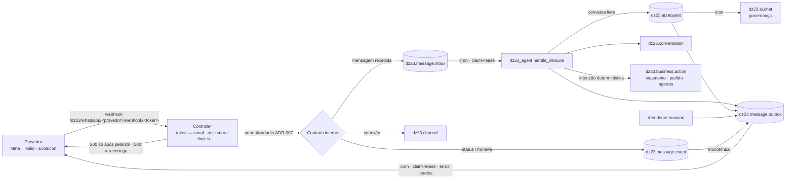

# DZ23 CRM — Arquitetura

> Visão para quem vai manter, revisar ou auditar o código. Decisões detalhadas nos
> [ADRs](docs/adr/); operação nos [runbooks](docs/runbooks/). Sem segredos.

## 1. Princípios
- **Odoo 19 Community intocado**: tudo em módulos próprios (`addons_custom/`) que
  herdam modelos pelo ORM e sobrevivem a atualizações do Odoo.
- **Sem infraestrutura extra**: filas, locks e deduplicação no PostgreSQL (sem broker,
  Redis ou Celery).
- **Garantias com o nome certo**: entrega *at-least-once*, efeito de negócio
  *exactly-once*, status monotônico, reconciliação por callback.
- **Multi-empresa por padrão**: cada canal pertence a uma empresa; *record rules*
  isolam todos os dados derivados.
- **Determinístico onde há dinheiro ou compromisso**: preço, pedido, agenda e pagamento
  nunca são decididos pela IA.

## 2. Runtime
```
docker/docker-compose.yml   odoo:19 (digest) + postgres:16 (digest)
  odoo :8069   addons_custom → /mnt/extra-addons ; addons_oca → /mnt/oca-addons
docker/evolution.yml        Evolution API (opcional, WhatsApp não oficial)
scripts/fetch_oca.sh        dependências OCA pinadas por commit
scripts/smoke.sh            instalação limpa + testes dz23 + upgrade em banco descartável
```

## 3. Módulos

Licença: MIT ([LICENSE](LICENSE); manifestos declaram "Other OSI approved licence").

| Módulo | Versão | Depende de | Responsabilidade |
|---|---|---|---|
| `dz23_branding` | 19.0.1.0.0 | web, mail, portal | Debrand, tema, PWA/push, pt-BR padrão |
| `dz23_brasil_tools` | 19.0.1.0.0 | contacts, phone_validation | CNPJ/CEP, feriados, câmbio |
| `dz23_whatsapp` | 19.0.15.0.0 | mail, phone_validation, sales_team | Canais, webhooks, normalização, inbox/outbox/eventos, mídia, templates, conversas, saúde, métricas, LGPD |
| `dz23_crm` | 19.0.1.0.0 | crm, dz23_whatsapp | Atalho de WhatsApp no lead |
| `dz23_ai` | 19.0.2.0.0 | base, mail, crm | Serviço de IA com governança |
| `dz23_agent` | 19.0.7.0.0 | dz23_whatsapp, dz23_ai, crm, calendar, phone_validation, resource, sale_management | Atendente: intenções, agenda, compra, fila de IA, handoff, métricas de negócio, LGPD do lead |
| `dz23_payment_woovi` | 19.0.2.0.0 | payment | Provedor PIX Woovi |
| `dz23_fiscal` | 19.0.1.0.0 | account | NF-e via provedor (fail-closed) |
| `dz23_integrations` | 19.0.1.0.0 | base_setup, mail | Central de integrações |

## 4. Fluxo de uma mensagem



### 4.1 Entrada
1. O token da URL resolve o canal (e a empresa). Autenticação por canal e fail-closed:
   ausente → 503, inválida → 401, payload de outro canal → 409, corpo > 1 MiB ou
   > 1000 eventos → 413.
2. Normalizadores puros convertem o payload no contrato interno; evento fora do contrato
   é descartado com log saneado.
3. Mensagem recebida vai para a inbox com dedupe `(provedor, canal, message_id)`;
   status vão para `dz23.message.event` (append-only, dedupe por
   canal+id+direção+status). Persistência antes do 200.

### 4.2 Processamento ([ADR-003](docs/adr/ADR-003-queue-claim-lease.md), [ADR-008](docs/adr/ADR-008-filas-logicas-e-erros-de-provedor.md))
- Crons reivindicam lotes com `FOR UPDATE SKIP LOCKED`, commit do claim, trabalho
  fora do lock, commit por item. Tentativas contadas no claim; lease vencido é
  recuperado; esgotado → DLQ com motivo.
- Filas lógicas: `inbox`, `ai_request`, `business_effect` (ações idempotentes),
  `outbox`, `status_event`, `media`, eventos Woovi.

### 4.3 Atendente
- Conversa por contato ([ADR-010](docs/adr/ADR-010-caixa-de-atendimento.md)): com humano
  no controle o robô só registra.
- Intenções determinísticas: pendência de compra, cancelar/remarcar/agendar, compra,
  preço. Efeitos passam por `dz23.business.action._run_once`
  ([ADR-005](docs/adr/ADR-005-business-actions-idempotentes.md)); agenda com lock
  consultivo e expediente/feriados do calendário
  ([ADR-004](docs/adr/ADR-004-agenda-sem-dupla-reserva.md)).
- Conversa livre vai para a fila de IA; assunto sensível, limite de respostas livres ou
  IA indisponível transferem para humano; guarda de saída troca valores/condições
  inventados ([ADR-011](docs/adr/ADR-011-governanca-de-ia.md)).

### 4.4 Saída e ciclo de vida
- Outbox classifica erros do provedor (transitório × permanente), respeita
  `Retry-After`, pausa o canal em 429 e limita itens por canal por execução.
- `sent` exige id de mensagem na resposta do provedor. Entregue/lida chegam por
  callback e só avançam (rank), nunca regridem
  ([ADR-006](docs/adr/ADR-006-message-lifecycle.md)).
- Fora da janela de 24 h (Meta/Twilio) só template aprovado
  ([ADR-009](docs/adr/ADR-009-midia-e-templates.md)).

## 5. IA ([ADR-011](docs/adr/ADR-011-governanca-de-ia.md))
`dz23.ai.chat(prompt, system, image_b64, company, purpose)`: provedor/política por
empresa, gate de consentimento, redação de PII, timeout por provedor, 429 tipado,
circuit breaker e limites; breaker/uso gravados em cursor próprio (sobrevivem ao
rollback do chamador).

## 6. Pagamento PIX
`payment.transaction` Woovi cria uma cobrança por transação (reaproveitada);
`dz23.woovi.event` persiste e deduplica o webhook (RSA) e a conciliação; confirmação
exige valor e moeda iguais; status monotônico, expiração e estorno.

## 7. Observabilidade ([ADR-012](docs/adr/ADR-012-observabilidade.md))
Saúde do canal calculada na leitura; `dz23.metrics.daily` por canal/dia no fuso da
empresa; logs `dz23_event=... chave=valor` sem PII.

## 8. LGPD ([ADR-013](docs/adr/ADR-013-lgpd-retencao.md))
Retenção/anonimização por empresa (pseudônimo HMAC), pedido do titular (exportar/
anonimizar), supressão por opt-out, auditoria de acesso append-only. Documentos fiscais
nunca são tocados.

## 9. Segurança e segredos
- Código só referencia nomes de parâmetros; valores ficam no banco (campos restritos a
  administrador) ou no `.env` do servidor — nunca no Git.
- Detalhes, limitações e resposta a incidente em [SECURITY.md](SECURITY.md).

## 10. Testes e CI
- 264 testes com tag `dz23` (sem rede, APIs simuladas, cursores reais para concorrência);
  mapa requisito → teste em [docs/TEST_MATRIX.md](docs/TEST_MATRIX.md).
- CI: ruff, gitleaks, bandit, semgrep, trivy, SBOM, instalação limpa + testes + upgrade.

## 11. Dependências externas (não são bugs)
- WhatsApp oficial em produção: aprovação de número e templates pela Meta.
- NF-e: certificado A1 + conta no provedor.
- Woovi ao vivo: conta + webhook público HTTPS.
- Google Agenda: OAuth configurado pelo usuário.
- Envio de mídia pelo WhatsApp: não implementado.
